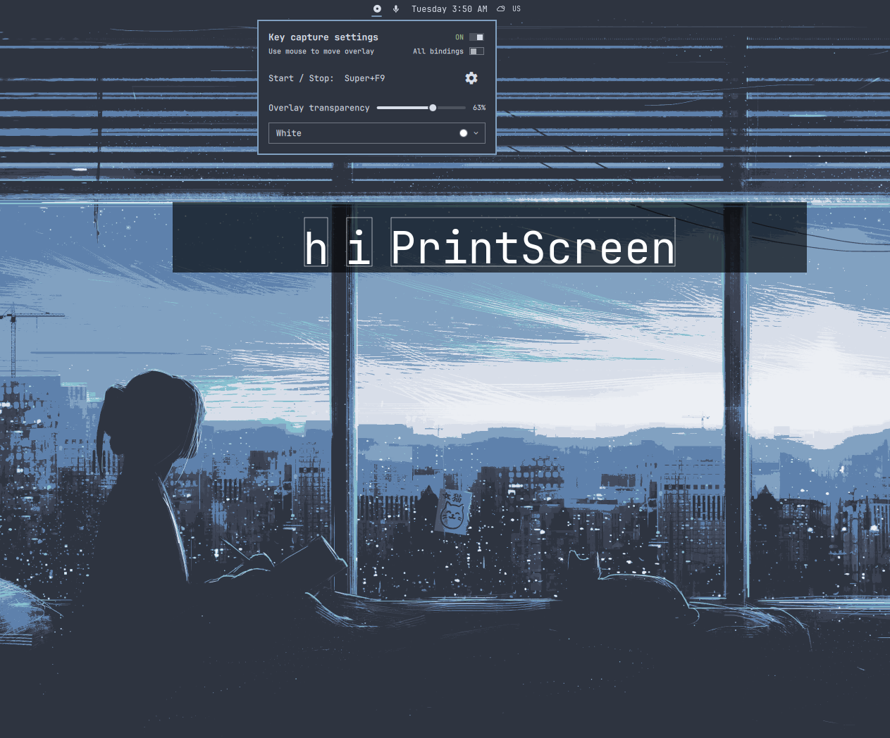

# Capture Control

Screen recording and visible key presses from one Omarchy bar icon, powered by
[Show Me The Key][showmethekey] one of the most popular key visualizers built 
for Wayland. Use Omarchy's recorder and turn the key display on when needed.



## Install

On Omarchy Quattro:

```bash
omarchy plugin add https://github.com/omarchy-QOL/omarchy-capture-control.git --enable
```

Right-click the bar icon to finish setup. If packages are missing, the panel
shows the exact `omarchy pkg add` command and asks **Yes / No**. Yes opens a
terminal for installation and any password prompt, then builds the private
renderer automatically. Once it finishes, right-click again for the settings.
No leaves recording available and key capture unconfigured.

On a standard Omarchy Quattro installation, the extra packages are
`showmethekey`, `meson`, and `glib2-devel`. Meson brings Ninja; Omarchy already
supplies Python and the base development tools. Only missing packages are
requested. The private renderer adds text colour support and clean shutdown;
your system's Show Me The Key stays unchanged. No Python command or window
rule needs to be copied.

## Use

- **Left-click** the bar icon to open the recording menu or stop a recording.
- **Right-click** to toggle the key display, set background opacity, and choose
  a text colour. Five presets and a custom hex colour are available.
- **Gear** opens the key display settings and your shortcuts in Neovim.
- **Only Omarchy** hides ordinary typing using the native filter.
  Super/Ctrl/Alt combinations remain visible, including application shortcuts.
  Bare Print, function keys, and media keys are hidden; mouse clicks are unchanged.
- **Super+F8**, if [configured](docs/setup.md#keyboard-shortcut), toggles keys.
  The panel shows your current shortcut.

Recording and key display work independently. Keys stay off until you turn
them on, and the bar icon is always there. New installations use white text
and **All bindings**.

Double-tap **Alt** to pause or resume the key display. Double-tap **Ctrl** to
make the overlay draggable, then again to let clicks pass through it.
Changing opacity or colour briefly restarts the overlay and resets its position.

## Remove

```bash
systemctl --user stop showmethekey-video.service
omarchy plugin remove io.github.ilyazar.capture-control
```

Remove any shortcut you added. If you hid the stock
recording indicator, restore it. Your settings remain available for
reinstalling.

[Setup and settings](docs/setup.md) · [Development](docs/development.md)

Part of [Omarchy QOL](https://github.com/omarchy-QOL). MIT licensed;
Show Me The Key is Apache-2.0 licensed.

[showmethekey]: https://github.com/AlynxZhou/showmethekey
